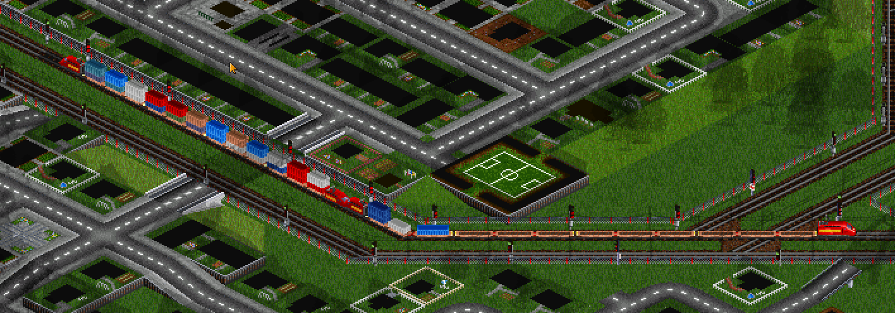

# Vanillaish Well Wagon

Simple NewGRF to intermodal containers transport

**Main Feature**: Double Stack Well Wagon

Well Wagon can transport all types of cargo except passengers and mail.

Default capacity is 60, but
for Steel is 40
for Oil is 80

*example train with well wagons*

#### TODO

- Parameters and running cost
- Static Company Colours
- ISO Tank sprites
- 5 Section Well Wagon
- Flat wagon to single container

#### CHANGELOG
#### 1.0

- add: 3 Section Well Wagon